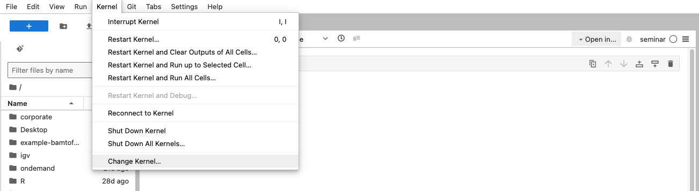
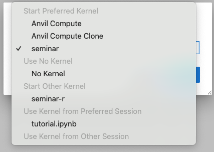
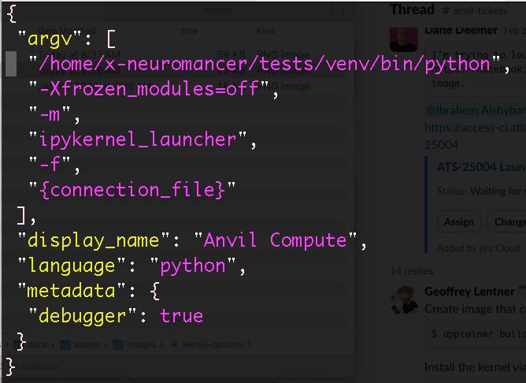
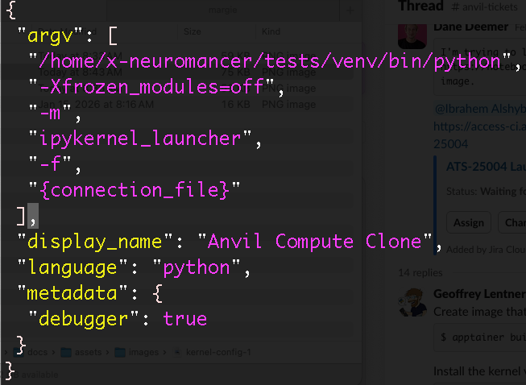
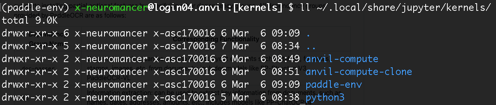
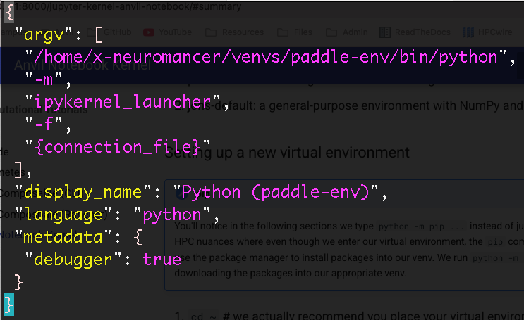
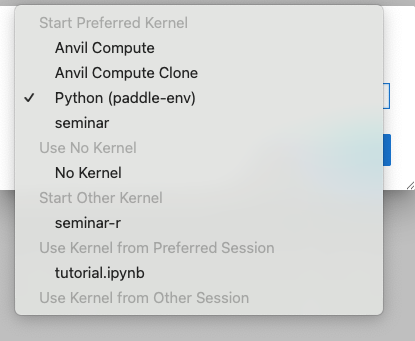
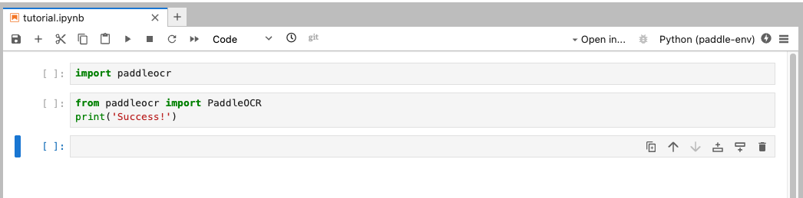

# Connecting a Virtual Environment to Jupyter Kernel

## Background

[Anvil notebook](https://notebook.anvilcloud.rcac.purdue.edu/) is a Jupyter Notebook service that connects directly to Purdue University's Anvil supercomputer on a compute node. This makes it easy to run your code interactively on the compute node.

When you execute code, it is using a specific **kernel** to run the python code.

When you click on the dropdown for the kernels, you may see a list similar to this:

In the **Start Preferred Kernel** group, you probably won't see the Anvil Compute Clone. Let's start by showing you where this information comes from.

When you login to Anvil, you navigate to your home directory and then continue to the directory where Anvil Notebook looks for kernels:

Start by ssh'ing onto Anvil via **<username\>@anvil.rcac.purdue.edu**

!!! warning
    Ensure you have setup your [SSH key](https://www.rcac.purdue.edu/knowledge/anvil/access/login/sshkeys) so you can login. Otherwise, use [OnDemand](https://ondemand.anvil.rcac.purdue.edu/) to view the files

1. `cd ~`  # navigate to your home directory
2. `cd .local/share/jupyter/kernels`  # this is where Anvil Notebook checks for kernels
3. `ls -lah`  # view all the files

Here, you should see a folder called `anvil-compute`. Inspect the contents of `anvil-compute/kernel.json`

* `cat anvil-compute/kernel.json`

The value *Anvil Compute* you see in Anvil Notebook comes from the parameter display_name: "Anvil Compute". The "argv" parameter contains a list with many variables. These are what tell Anvil Notebook what to execute when you click "Run" in our notebook. Here, we see the first argument is:

`/home/x-neuromancer/tests/venv/bin/python`

This file exists in that location and points to a specific virtual environment (venv) when it runs Python. Feel free to look into the other params as you need to.

So we don't mess with this, copy this whole folder and then edit the *display_name* value:

1. `cp -r anvil-compute anvil-compute-clone`
2. `vim anvil-compute-clone/kernel.json`  # or use your favorite editor

Now navigate back to Anvil Notebook, click on Change Kernel, and verify you can see this new kernel (called Anvil Compute Clone, or whatever you decide to call it!).

### Summary

We cloned the Anvil Compute virtual environment in `~/.local/share/jupyter/kernels/anvil-compute`, adjusted a config value, and now Anvil Notebook should us a new option for our **kernel** to use.

!!! warning
    Both the original and the cloned Kernels point to the same virtual environment. In the next section, we will create a fresh and new virtual environment with different dependencies.

## New Kernel (venv)

In this section, we will create 2 new virtual environments, download some new packages, and then run it on Anvil Notebook. Our environments:

1. paddle-env: for running OCR workloads using [PaddleOCR](https://github.com/PaddlePaddle/PaddleOCR)
2. Create another venv by duplicating these steps but changing the name and packages you install.

### Setting up a new virtual environment

!!! note "pip"
    You'll notice in the following sections we type `python -m pip ...` instead of just `pip ...`. This is because of some HPC nuances where even though we enter our virtual environment, the `pip` command doesn't always get updated to use the package manager to install packages into our venv. We run `python -m pip ...` to be extra safe that we are downloading the packages into our appropriate venv.

1. `cd ~`  # we actually recommend you place your virtual environments on your $PROJECT space, but I'll place these on the home directory for convenience of writing this tutorial
2. `mkdir -p venvs`
3. `cd venvs`
4. `module load python`  # load in python
5. `python3 -m venv paddle-env`  # create the virtual environment (venv)
6. `source paddle-env/bin/activate`  # jump into the venv
7. `python -m pip install --upgrade pip`  # maintenance command to ensure latest version of pip
8. `python -m pip install paddleocr`  # install paddleocr
9. `python -m pip install ipykernel`  # install the kernel config so it's easier to connect to Anvil Notebook
10. `python -m pip list`  # verify you see all the packages you needed!
11. `python -m ipykernel install --user --name paddle-env --display-name "Python (paddle-env)"`

That final step takes care of creating a new folder in `~/.local/share/jupyter/kernels/`. The `--name paddle-env` specifies we want the folder `paddle-env`, and `--display-name` specifies we want **Python (paddle-env)** to show up in Anvil Notebook (or wherever we connect our Jupyter notebook).

Opening up the config (`~/.local/share/jupyter/kernels/paddle-env/kernel.json):

Here, we see the `argv` first list option points to `/home/x-neuromancer/venvs/paddle-env/bin/python`, which tells the kernel to execute from this python binary executable.

!!! note
    You will see a slightly different path that contains your own username, not x-neuromancer (used as an example).

### Checking the environment in Anvil Notebook

When you navigate back to Anvil Notebook, select Kernel >> Change Kernel and click on the dropdown, you should see the new Python (paddle-env) venv:

Next, run a few test commands to ensure you have access to the paddocr package you installed previously:

If these cells run, you should be all good to go with your new kernel!

### Installing new packages

To install new packages to an existing kernel, such as paddle-env, follow these steps:

1. Log in to Anvil via ssh
2. `source ~/venvs/paddle-env/bin/activate`  # if your venv lives in a different folder, point to the appropriate folder and activate your venv
3. `python -m pip install <package-name-1\>`
4. `python -m pip install <package-name-2\>`

## New Kernel (uv)

This is pretty similar to setting up a new kernel from a virtual environment using venv, but there are some slight modifications. Basically, replace all `python -m pip ...` command with `uv pip ...`. We will update this tutorial soon once we test the use cases.